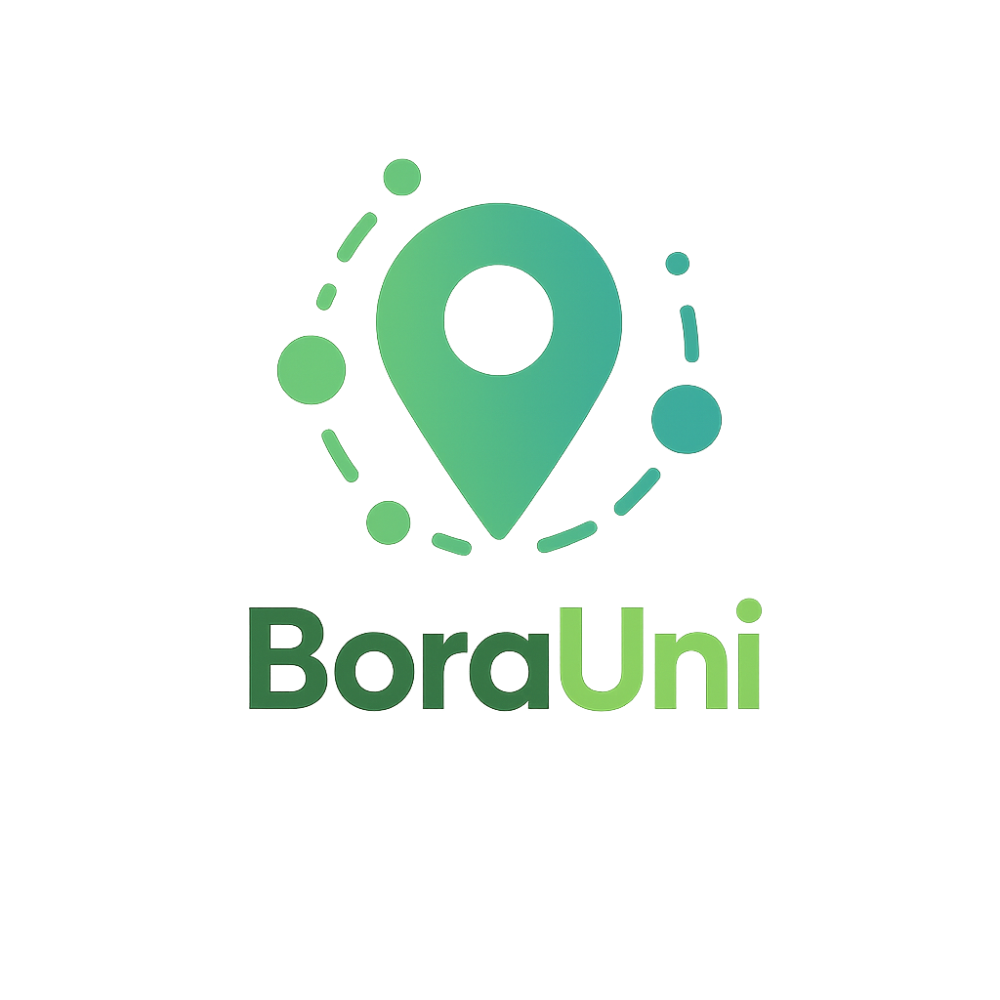

# 📱 BoraUni - FrontEnd - Aplicativo de Carona Universitária

antes de começar saiba que é necessario usar o nosso backend para a execução do endpoint da aplicação, disponível em:
(https://github.com/leocapra/UPX-ADS-BACKEND/tree/main)



---

## Índice

- [1. Visão Geral](#1-visão-geral)
- [2. Como Rodar o Projeto](#2-como-rodar-o-projeto)
- [3. Considerações Finais](#3-considerações-finais)

---

## 1. Visão Geral

**Nome do Projeto:** BoraUni

**Descrição:**
O **BoraUni** é um aplicativo mobile de carona compartilhada para universitários, desenvolvido em **React Native** com Expo. Ele conecta estudantes que desejam dividir caronas para a faculdade, promovendo a colaboração e ajudando a reduzir os custos de transporte.

---

## 2. Como Rodar o Projeto

### Passo a Passo

1. **Clonar o Repositório**
   - Clone o repositório ou faça o download do arquivo ZIP do projeto:
     ```bash
     git clone <link>
     cd UPX-ADS/
     ```

**Observação**: Caso tenha problemas com a chave SSH, você pode pedir a permissão para acesso ao repositório de forma segura, visto que não podemos divulgar a chave pública por questões de segurança.

2. **Trocar para o Branch `develop`**
   - Após clonar o projeto, mude para o branch `develop`:
     ```bash
     git checkout develop
     ```

3. **Instalar Dependências**
   - No diretório raiz do projeto, instale as dependências com o NPM (Node Package Manager). Se não tiver o NPM instalado, [consulte a documentação oficial do Node.js](https://nodejs.org/en/docs/) para mais detalhes:
     ```bash
     npm install
     ```

4. **Rodar o Projeto**
   - Para rodar o aplicativo, use o comando:
     ```bash
     npm run start
     ```

Ou, se desejar, use os caminhos fornecidos diretamente na plataforma para avaliar a estrutura e o código do projeto.

---

## 3. Considerações Finais

Caso tenha algum problema durante a execução do projeto ou dúvidas, entre em contato comigo no número **15981518395** para suporte.

---

<p align="center">Desenvolvido com ❤️ por Grupo 09 - 2025</p>

Explicação da Estrutura do Projeto React Native
Nosso projeto foi organizado de forma modular para facilitar a manutenção e o desenvolvimento. Aqui está a estrutura principal:

Estrutura de Pastas

app: Contém os arquivos gerais do aplicativo.

auth: Responsável por todo o sistema de autenticação (login, cadastro, etc.).

driver: Contém todas as funcionalidades do aplicativo para motoristas.

student: Contém todas as funcionalidades do aplicativo para estudantes.

Assets

Dentro de @/assets, temos todas as imagens fornecidas para o projeto.

Services

A pasta services contém as configurações relacionadas ao Axios, que é a biblioteca que usamos para fazer as interações com o backend. Dentro dela, temos o arquivo api.ts, que configura a API de forma global.

Além disso, as chamadas à API são organizadas por módulos, dividindo os serviços em categorias para facilitar a manutenção e seguir boas práticas de desenvolvimento.

Components

Não houve grandes alterações nos componentes padrão do Expo. Usamos o que já estava pré-configurado para garantir a integração rápida.

Hooks Personalizados

Criamos dois hooks personalizados para facilitar as chamadas à API:

useMutation: Utilizado principalmente para métodos POST, PUT, DELETE, PATCH, etc. É ideal para chamadas que alteram dados no backend.

useQuery: Utilizado para chamadas GET, onde buscamos dados do backend sem alterar seu estado.

Basicamente, esses hooks são importados para os componentes onde são necessários, tornando o código mais organizado e reutilizável.
